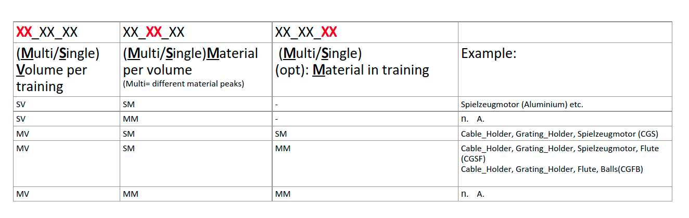
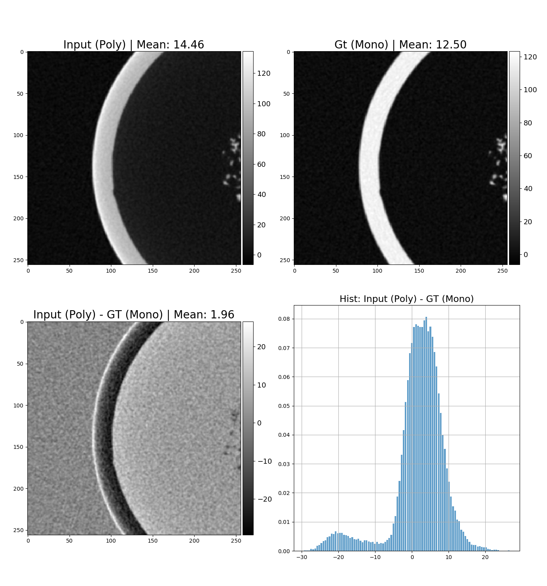

About DL-BeamHardening 
===========


This repository contains the work related to the deep-learning based beam hardening removal. 


Setup-Project: 
===========
**Install Python packages:**  
```pip install torch pytorch-lightning torchmetrics matplotlib h5py numpy einops pyqt5``` 

**Build Voxie & Model-load extension:**  
```tools/build.sh```  

Repository-Structure: 
===========
📦dl_beamhardening   
 ┣ 📂aRTist_project  
 ┃ ┣ Example aRTist projects with IPVS settings       
 ┃ ┗ 📂Spektren  
 ┃ ┃ ┗ Mono & poly (IPVS-Setup) spectrum files       
 ┣ 📂data_analysis_scripts  
 ┃ ┗ Scripts for calculating mean gray value, data analysis & .tiff plot   
 ┣ 📂dataset_preparation_scripts   
 ┃ ┣ 📂preprocessing  
 ┃ ┃ ┗ Script for flatfield correction  
 ┃ ┣ 📂tiff_to_hdf5  
 ┃ ┃ ┣ 📂stuff  
 ┃ ┃ ┃ ┗ Various debug, plot & volume compare scripts  
 ┃ ┃ ┗ Tiff to hdf5 converter script  
 ┃ ┗ Script for transposing & cutting volumes  
 ┣ 📂doc 
 ┃ ┗ OneNote notebook & exported OneNote pages    
 ┣ 📂models  
 ┃ ┣ 📂checkpoints    
 ┃ ┃ ┗ CNN-AI-CT checkpoints/traces that can be loaded by voxie   
 ┃ ┣ 📂test_cases  
 ┃ ┃ ┗ unittest, to check dataloader logic   
 ┃ ┣ 📜CNN_ai_ct.py  
 ┃ ┣ 📜CNN_ai_ct_silu.py  (CNN-AI-CT with SILU-Activations)     
 ┃ ┣ 📜CNN_ai_ct_skip.py  (CNN-AI-CT with SKIP-Connections)     
 ┃ ┣ 📜CNN_ai_ct_trans_skip.py   (CNN-AI-CT with SKIP-Connection & extra Linear-Layers)   
 ┃ ┣ 📜IRR_CNN_ai_ct.py  (CNN-AI-CT with Iterative-Residual-Refinement)   
 ┃ ┣ 📜PerceiverModel.py  (DeepMinds Perceiver-Model)   
 ┃ ┣ 📜Unet.py   
 ┃ ┣ 📜dataloader.py  
 ┃ ┣ 📜datasets.json  (Contains path of all datasets)  
 ┃ ┣ 📜debug_datasets.json    
 ┃ ┣ 📜noisy_indexes.json  (Contains indices of slices that contain only noise 256x256 patches)    
 ┃ ┣ 📜parseTorchScript.py  
 ┃ ┣ 📜removeBeamHardening.py (Remove Beam-Hardening from volume with passed checkpoint)   
 ┃ ┣ 📜runModel.py (Script to load & test checkpoints)      
 ┃ ┣ 📜train.py (Main script to start training & choose  models)    
 ┃ ┣ 📜utils.py  
 ┃ ┗ 📜visualization.py  
 ┣ 📂src  
 ┃ ┗ Extern voxie filter to load pyTorch models (traces) of CNN-AI-CT   
 ┣ 📂subprojects  
 ┃ ┗ 📂voxie-intern  
 ┣ 📂test_data  
 ┃ ┗ small volume data for test-purposes  
 ┣ 📂tools  
 ┃ ┗ build script (Voxie + extension) & normalisation  script  
 ┣ 📜.clang-format  
 ┣ 📜.gitignore  
 ┣ 📜.gitmodules  
 ┣ 📜README.md  
 ┗ 📜meson.build  

## Use-cases naming convention
> To distinguish different training runs & model checkpoints



Training & RunModel 
===========

For training and checkpoint loading details/ scripts check this folder on pasnas:

```/net/pasnas01/pool1/enpro-2021-voxie/training/slurm_files```

This folder contains all used slurm and corresponding bash scripts. 

Dataset preparation scripts
===========
### tiff_to_hdf5

>Converts a bunch of Tiff files into a single HDF5 file and appends meta-data needed for the reconstruction. >Manual flat-field correction can be applied if needed.  

**Run:** (Without flat-field correction): 

```
<python-interpreter> tiff_to_hdf5.py -f <path-tiff-file-folder> -o <absolute-path-of-output> -dsra <distance-source-rotation>
```

**Run:** (With flat-field correction): 

```
<python-interpreter> tiff_to_hdf5.py -f <path-tiff-file-folder> -o <absolute-path-of-output> -dsra <distance-source-rotation> -w <path-to-white-tiff-image>
```

**Hint:** 
- distance-source-rotation must be in meter [m] 
- white-image: Ct-projection image without an object and detector noise but apart from this with the same parameters as the normal projections

### reco_post_processing.py  

>Transposes and cuts the monochromatic and polychromatic >reconstructed volumes identical. 

**Run:**
```
<python-interpreter> reco_post_processing.py -fp <path-reconstructed-volume-poly-hdf5> -fm <path-reconstructed-volume-mono-hdf5> -op <output-path-poly-hdf5> -om <output-path-mono-hdf5> -fc <cutting-coefficient>  
```

**Hint:** 
- cutting-coefficient: The factor is multiplied with the mean_grey_value of the volume. Slices are then removed if the mean slice gray value is lower as this product.


Dataset analysis scripts
===========
### plot_sample_differences.py

>Create images of the slices that can be used to analyze the data:
> Poly, Mono, Poly-Mono & Histogram(Poly-Mono)

**Run:**
```
<python-interpreter> plot_sample_differences.py -f <dataset-json-file-path> -o <output-path> -ss <step-size> -dn <names-of-datasets>
```
**Hint:** 
- step-size: Each int(dataset_size/step_size) sample is written out
- names-of-datasets: Default is all
- output-looks like: 

### calculate_cutted_mean.py

>Calculates the mean gray value of a volume and appends it as meta-data. 

```
calculate_cutted_mean.py -f <dataset-json-file-path> -dn <names-of-datasets>
```

**Hint:** 
- names-of-datasets: Default is all